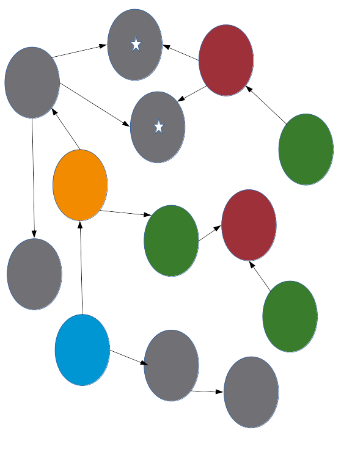
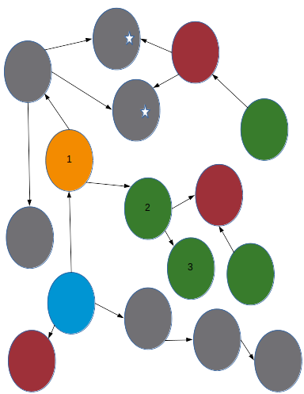

# `chap` User's Guide

## Table of contents
* [Overview](#overview)
    * [Where to Run `chap`](#where-to-run-chap)
    * [Supported Process Image File Formats](#supported-process-image-file-formats)
    * [Supported Memory Allocators](#supported-memory-allocators)
    * [How to Start and Stop `chap`](#how-to-start-and-stop-chap)
    * [Getting Help](#getting-help)
    * [General Concepts](#general-concepts)
* [Allocations](#allocations)
    * [Used Allocations](#used-allocations)
    * [Free Allocations](#free-allocations)
    * [An Example of Used and Free Allocations for a C Program](#an-example-of-used-and-free-allocations-for-a-c-program)
* [References](#references)
    * [Real References](#real-references)
    * [False References](#false-references)
    * [Missing References](#missing-references)
* [Identifying the Contents of an Allocation](#identifying-the-contents-of-an-allocation)
    * [Allocation Signatures](#allocation-signatures)
        * [An Example from C++ of Vtable Pointer Signatures](#an-example-from-c-of-vtable-pointer-signatures)
        * [Ways That `chap` Can Convert Vtable Pointer Signatures to Names](#ways-that-chap-can-convert-vtable-pointer-signatures-to-names)
            * [Finding Class Names and Struct Names from the Core](#finding-class-names-and-struct-names-from-the-core)
            * [Finding Class Names and Struct Names from the Core and Binaries](#finding-class-names-and-struct-names-from-the-core-and-binaries)
            * [Depending on gdb to Convert Addresses to Symbols](#depending-on-gdb-to-Convert-Numbers-to-symbols)
    * [Allocation Patterns](#allocation-patterns)
        * [Patterns Related to C++ Containers](#patterns-related-to-c-containers)
        * [Patterns Related to OpenSSL](#patterns-related-to-openssl)
        * [Patterns Related to Python](#patterns-related-to-python)
* [Allocation Sets](#allocation-sets)
* [Allocation Set Modifications](#allocation-set-modifications)
    * [Restricting by Signatures or Patterns](#restricting-by-signatures-or-patterns)
    * [Restricting by Counts of Incoming or Outgoing References](#restricting-by-counts-of-incoming-or-outgoing-references)
    * [Set Extensions](#set-extensions)
        * [General Extension Examples With Pictures](#general-extension-examples-with-pictures)
        * [Examples About Traversing C++ Containers](#examples-about-traversing-c-containers)
* [Use Cases](#use-cases)
    * [Detecting Memory Leaks](#detecting-memory-leaks)
    * [Analyzing Memory Leaks](#analyzing-memory-leaks)
    * [Supplementing gdb](#supplementing-gdb)
    * [Analyzing Memory Growth](#analyzing-memory-growth)
        * [Analyzing Memory Growth Due to Used Allocations](#analyzing-memory-growth-due-to-used-allocations)
        * [Analyzing Memory Growth Due to Free Allocations](#analyzing-memory-growth-due-to-free-allocations)
    * [Detecting Memory Corruption](#detecting-memory-corruption)


## Overview
This manual describes how to use `chap` which is a tool that looks at process images and identifies dynamically allocated memory and how it is used.  Although `chap` can detect memory leaks, and should be used as part of any test framework to do so, given the relative infrequency of introduction of leaks to the code, probably the most common usage is as a supplement to gdb to help understand the current usage of various addresses in memory, meaning that anyone who uses gdb at all to debug processes that use any code at all written in C++ or C should probably have chap available as a supplement.  Another major use case is understanding why a process is as large as it is, particularly in the case of growth of containers such as sets, maps, vectors and queues and such but not limited to that.  Those and other use cases are covered later in this manual.

### Where to Run `chap`
At present this has only been tested on Linux, with the `chap` binary built for 64bit x86-64.

### Supported Process Image File Formats
At the time of this writing, the only process image file formats supported by `chap` are little-endian 32 bit ELF cores and little-endian 64 bit ELF cores, both of which are expected to be complete.  Run `chap` without any arguments to get a current list of supported process image file formats.  Note that due to recent changes in gdb, which is normally involved in producing the core whether the process crashed or a live core was generated using gcore, it is best to make sure that the coredump filter for the process for which the core is needed is set to 0x37.  So for example for a process with pid 123:

```
echo 0x37 >/proc/123/coredump_filter
gcore 123
```


### Supported Memory Allocators
At present the only memory allocators for which `chap` will be able to find allocations in the process image are the following:
* the version of malloc used by glibc on Linux
* the arena-based allocator for Python 2.x and 3.x (only checked so far on 2.6, 2.7 and 3.5, including both cases where arenas are mmapped and where they are allocated using malloc)

Even lacking support for jemalloc or tcmalloc there are many processes for which `chap` is useful, because many processes use glibc malloc as part of native libraries.

A quick way to determine whether `chap` is likely to be useful for your process is to gather a core (for example, using gcore) then open chap and use **count allocations**.  If the count is non-zero, `chap` is applicable.

```
-bash-4.1$ chap core.33190
chap> count allocations
734 allocations use 0x108900 (1,083,648) bytes.
chap>
```

### How to Start and Stop `chap`
Start `chap` from the command line, with the core file path as the only argument.  Commands will be read by `chap` from standard input, typically one command per line.  Interactive use is terminated by typing ctrl-d to terminate standard input.

### Getting Help
To get a list of the commands, type "help<enter>" from the `chap` prompt.  Doing that will cause `chap` to display a short list of commands to standard output.  From there one can request help on individual commands as described in the initial help message.

### General Concepts
Most of the commands in `chap` operate on sets.  Normally, for any set that is understood by chap one can **count** it (find out how many there are and possibly get some aggregate value such as the total size), **summarize** it (provide summary information about the set), **list** it (give simple information about each member such as address and size), **enumerate** it (give an identifier, such as an address, for each member) and **show** it (list each member and dump the contents), **describe** it (provide a brief description for each member) or **explain** it (provide a possibly quite long explanation for each member of the set).  See the **help** command in chap to list which verbs are currently provided and to list which sets are supported for a given verb.

Most of the sets that one can identify with `chap` are related to **allocations**, which roughly correspond to memory ranges made available by memory allocation functions, such as malloc, in response to requests.  Allocations are considered **used** or **free**, where **used** allocations are ones that have not been freed since they last were made available by the allocator.  One can run any of the commands listed above (count, list ...) on **used**, the set of used allocations, **free**, the set of free allocations, or **allocations**, which includes all of them.  If a given type is recognizable by a [signature](#allocation-signatures) or by a [pattern](#allocation-patterns), one can further restrict any given set to contain only instances of that type. A very small set that is sometimes of interest is "allocation *address*"  which is non-empty only if there is an allocation that contains the given address.  Any specified allocation set can also be restricted in various other ways, such as constraining the size.  Use the help command, for example, **help count used**, for details.

Other interesting sets available in `chap` are related to how various allocations are referenced.  For now this document will not provide a thorough discussion of references to allocations but will briefly address how `chap` understands such references to allocations.  From the perspective of `chap` a reference to an allocation is normally a pointer-sized value, either in a register or at a pointer-aligned location in memory, that points somewhere within the allocation.  Note that under these rules, `chap` currently often identifies things as references that really aren't, for example, because the given register or memory region is not really currently live.  It is also possible for certain programs, for example ones that put pointers in misaligned places such as in fields of packed structures, but this in general is easy to fix by constraining programs not to do that.  Given an address within an allocation one can look at the **outgoing** allocations (meaning the used allocations referenced by the specified allocation) or the **incoming** allocations (meaning the allocations that reference the specified allocation).  Use the help command, for example, **help list incoming** or **help show exactincoming**, or **help summarize outgoing** for details of some of the information one can gather about references to allocations.

References from outside of dynamically allocated memory (for example, from the stack or registers for a thread or from statically allocated memory) are of interest because they help clarify how a given allocation is used.  A used allocation that is directly referenced from outside of dynamically allocated memory is considered to be an **anchor point**, and the reference itself is considered to be an **anchor**.  Any **anchor point** or any used allocation referenced by that **anchor point** is considered to be **anchored**, as are any used allocations referenced by any **anchored** allocations. A **used allocation** that is not **anchored** is considered to be **leaked**.  A **leaked** allocation that is not referenced by any other **leaked** allocation is considered to be **unreferenced**.  Try **help count leaked** or **help summarize unreferenced** for some examples.

Many of the remaining commands are related to redirection of output (try **help redirect**) or input (try **help source**) or related to trying to reduce the number of commands needed to traverse the graph (try **help enumerate chain**).  This is being documented rather gradually.  If there is something that you need to understand sooner than that, and the needed information happens not to be available from the help command within chap, feel free to file an issue stating what you would like to be addressed in the documentation.

## Allocations

An **allocation**, from the perspective of `chap` is a contiguous region of virtual memory that was made available to the caller by an allocation function or is currently reserved as writable memory by the process for that purpose.  At present the only allocations found by chap are the following:
* allocations made via calls into libc malloc, for example to malloc(), possibly called indirectly by new() in C++, calloc() or realloc()
* allocations made via the allocator in cpython

There are definitely some allocations made directly via mmap() that are not found by chap, including allocations done via allocators used for other languages.


### Used Allocations

A **used allocation** is an **allocation** that was at some point returned by an allocator and that not given back to the allocator after that time.  From the perspective of `chap`, this explicitly excludes regions of memory that are used for book-keeping about the allocation but does include the region starting from the address returned by the caller and including the full contiguous region that the caller might reasonably modify.  This region may be larger than the size requested at allocation, because the allocation function is always free to return more bytes than were requested by the caller.

### Free Allocations
A **free allocation** is a range of writable memory, readable and writable by the process at the time the core was created, that can was available to satisfy allocation requests.  It is worthwhile to understand these regions because typically memory is requested from the operating system in multiples of 4K pages, which are subdivided into allocations.  It is more common than not that when an allocation gets freed, it just gets given back to the allocator but the larger region containing that allocation just freed cannot yet be returned to the operating system.

### An Example of Used and Free Allocations for a C Program 

Consider the following nonsense code which allocates enough space to store 2 int values, sets the first int value in the allocation to 92 and the second to 93, then crashes:

```
#include <malloc.h>
int main(int argc, const char**argv) {
   int *pI = (int *) (malloc(2 * sizeof(int)));
   pI[0] = 92;
   pI[1] = 93;
   *((int *) 0) = 92; // crash
   return 0;
}
```

Suppose we compile this as a 64-bit application, for example, compiling it as follows:


```
$ gcc -o example1 example1.c
```

We can generate a core just by running this application but at some point before we
do so we need to make sure that the process is allowed to create a core and that
the coredump_filter is set in a way that the process will have the information we need.
A value of 0x37 is recommended, for reasons to be explained later.


```
$ ulimit -c unlimited
$ echo 0x37 >/proc/self/coredump_filter
```

Now we can run the program with the reasonable expectation that a core will be generated.  There
are other ways to get a core for a process (e.g. using gcore or gdb).

```
$ ./example1
Segmentation fault (core dumped)
```

Now that the core exists, in this particular case in a file called "core" in the current directory, we can start chap.  That line that starts with "chap>" is the chap prompt and indicates that chap has finished the initial valuation of the core file.  This step may take quite a while for a very large core file but should be fast for a small one.

```
$ chap core
chap>
```

Now that we have reached the chap prompt, we can gather information about allocations, or more particularly sets of allocations.  Most of the important commands in chap apply to various kinds of sets, including sets of allocations.

For example, the **count** command applies to various kinds of sets and generally will provide the number of members in the set as a count in decimal, possibly followed by total size used, in hexadecimal and usually in decimal as well, with the decimal value in parentheses.  For example:

```
chap> count allocations
3 allocations use 0x20fe0 (135,136) bytes.
chap>
```

In the preceding example, **allocations** refers to the set containing every **allocation**, as defined in this section.  We could alternatively use **count used** to provide the same information but just for the set containing every **used allocation** or **count free** to provide the same information for the set containing every **free allocation**.

```
chap> count used
2 allocations use 0x2a0 (672) bytes.
chap> count free
1 allocations use 0x20d40 (134,464) bytes.
```

Not surprisingly, if we sum the counts given for **used** and **free** we get the total counts given for **allocations** because any **allocation** is considered by chap to be **used** or **free**.  Generally, **used** is the most interesting set but **free** can be extremely important as an allocation set specifier if the memory used by **free** allocations is large and **allocations** can be important if we want to see all the allocations, for explanatory purposes.

Another thing we can do with sets of things is to **list** them.  Typically **list** provides that same information as **count**, with some small information about each member of the set, including minimally the address and size.  In the case of the simple sets **allocations**, **used** and **free**, the members of the set are listed in increasing order of address.

So, for example, suppose we want to understand why **count allocations** showed that there are 3 allocations, when the above code in **main** only called **malloc()** once.  We already saw from the above use of **count used** and **count free** that there were actually 2 used allocations and one free one, but an alternative would be to list every **allocation**, **used** or **free** as follows:


```
chap> list allocations
Used allocation at 55d90dacc010 of size 288

Used allocation at 55d90dacc2a0 of size 18

Free allocation at 55d90dacc2c0 of size 20d40

3 allocations use 0x20fe0 (135,136) bytes.
```

The function **main()** only asked for one allocation, of size 8 (2 * sizeof(int)), but we see 3 allocations and the smallest one has size 0x18.  The above output reinforces a few points made in the first paragraph of this section:

* Typically the allocator asks the operating system for memory in multiples of 4K pages, and splits them up into allocations.  So it appears that in this case libc malloc asked the operating system for 0x21000 bytes and that free allocation at 0x55d90dacc2c0 can be used to satisfy requests for memory.  We might reasonably guess, given the location of the free allocation after the used allocations, that libc malloc, after requesting 0x21000 bytes from the operating system, is initially carving allocations off the front.
* The allocator may return more than is requested.  That is why the smallest allocation listed above has size 0x18, not 8.
* An **allocation** as understood by chap, does not include any book-keeping overhead that is owned solely by the allocator.  That is one reason that the 3 allocations shown above actually have a gap between them (0x55d90dacc010 + 0x288 = 0x55d90dacc298) and (0x55d90dacc2a0 + 0x18 = 0x55d90dacc2b8).


Although it can be helpful to look at all the allocations, as shown above, for some ways of understanding what the allocator is doing behind the scenes, it is more common to focus on **used** allocations, because those are more directly under control of the application.   We can list just those used allocations:

```
chap> list used
Used allocation at 55d90dacc010 of size 288

Used allocation at 55d90dacc2a0 of size 18

2 allocations use 0x2a0 (672) bytes.
```

The above doesn't really tell us how those applications are used but there are other ways of figuring this out.  One can **show** the contents of an entire set, for example by using **show used** to show the contents of all **used** allocations.
```
chap> show used
Used allocation at 55d90dacc010 of size 288
  0:                0                0                0                0
 20:                0                0                0                0
 40:                0                0                0                0
 60:                0                0                0                0
 80:                0                0                0                0
 a0:                0                0                0                0
 c0:                0                0                0                0
 e0:                0                0                0                0
100:                0                0                0                0
120:                0                0                0                0
140:                0                0                0                0
160:                0                0                0                0
180:                0                0                0                0
1a0:                0                0                0                0
1c0:                0                0                0                0
1e0:                0                0                0                0
200:                0                0                0                0
220:                0                0                0                0
240:                0                0                0                0
260:                0                0                0                0
280:                0 

Used allocation at 55d90dacc2a0 of size 18
      5d0000005c                0                0 

2 allocations use 0x2a0 (672) bytes.

```

Based on the source code for **main()** shown above, where two non-zero **int** values were set in the allocation, the allocation at 0x55d90dacc2a0 looks like a better fit to be the one allocated in **main()**.

There are a few things needed to understand about the **show** command:

* The output is as if the allocation was filled with pointers.  In this case the example was compiled as a 64 bit allocation, so the allocation is shown in groups of 64 bits (8 bytes).
* For the case of an allocation too large to be shown in one line, the value at the left before the ":" gives the offset of the first pointer-sized range shown on the line, relative to the start of the allocation.
* The contents of each pointer-sized range are displayed in hexadecimal, as is common with pointers.
* The contents of each pointer-sized range are displayed in an order that makes it easy to read as a pointer.  Given that the target platforms supported by chap are little-endian, this means that the bytes within each pointer-sized range appear in the output in the opposite order in which they appear in memory.

To see this we can look at the allocation at 0x55d90dacc2a0 using gdb to see it in byte order:

```
(gdb) x/24bx 0x55d90dacc2a0
0x55d90dacc2a0:	0x5c	0x00	0x00	0x00	0x5d	0x00	0x00	0x00
0x55d90dacc2a8:	0x00	0x00	0x00	0x00	0x00	0x00	0x00	0x00
0x55d90dacc2b0:	0x00	0x00	0x00	0x00	0x00	0x00	0x00	0x00
```

Given that gdb is much more flexible about which radix is used and how many bytes should be shown in each group, we might also display the allocation as int values in decimal and see that in fact this allocation is a very good fit for the one allocated in **main()**:

```
(gdb) x/6wd 0x55d90dacc2a0
0x55d90dacc2a0:	92	93	0	0
0x55d90dacc2b0:	0	0

```

One might reasonably question why chap is so limited in the formats available to the **show** command and why chap has that particular default of displaying the contents of an allocation as if it were filled with pointers.  The reason for the default is that pointer values in allocations happen to be extremely useful to understanding how those allocations are used.  The reason that the set of formats available to the **show** command is so limited is simply that it is not a high priority to provide other formats.  Anyone who might want to add a new format should see [CONTRIBUTING.md](https://github.com/vmware/chap/blob/master/CONTRIBUTING.md) for information on how to contribute to chap.

Another question might be why that allocation at 0x55d90dacc010 exists.  The contents of that allocation, which are all 0, are not very informative by themselves.  The bottom line is that the techniques shown so far aren't really enough to understand that, except that possibly one might guess based on the fact that the allocation appears near the start of the same 0x21000-byte range that contains the other allocations, and that the allocator appears to be carving off allocations from the remaining unused part of that larger range, that the allocation at 0x55d90dacc010 may have been allocated rather early in the start of the process.

## References

Aside, from allocations, the most important thing to understand about ```chap``` is what it considers to be a **reference**.  Basically a **reference** is an interpretation of any range of memory or contents of a register as a live address to somewhere in that allocation.  In the most straight-forward case this is just a pointer in the native order (which is little-endian everywhere `chap` has been tested.).  Much of the value of chap is in understanding the nature of such references, because references are key to understanding whether an allocation is leaked and how an allocation is used.

### Real References

A real reference is a case where the interpretation is valid and in fact the given register or memory is still in use to reach the given allocation.

### False References

A false reference is where the interpretation is wrong.  This can happen for many reasons.  The most common cause of false references is that the allocator has returned a range of memory that is bigger than what was requested and so the bytes at the end are simply left over from the last time.

Another cause of false references is that some part of the allocation, even in the part of the range actually known to the code that requested the allocation, is simply not currently in use.  This is common with std::vector, which often has a capacity that is larger than the number of elements used or in any similar case where the allocation contains some range of memory that can be used as a buffer but for which the part of that range is actually in use varies.

Another case of false references are when the range just happens to look like it contains a reference but in fact contains one or more smaller values.

### Missing References

A missing reference would be a case where a reference exists but `chap` can't detect it.  One example of this might be if the reference was intentionally obscured by some reversible function.  Fortunately, this is extremely rare on Linux.  This is a good thing because, as will be seen later in this document, accurate leak detection depends on not having any missing references.

## Identifying the Contents of an Allocation

There are are two main ways that chap can help identify the contents of an allocation.  One way, mostly of interest for a subset of C++ classes and structs is to look for a **signature** in the first pointer-sized range of an allocation.  The other way is via the use of a **pattern**, which uses the broader context of the whole allocation and references to and from that allocation.  Both are discussed in more detail below.  Identifying the contents of an allocation can be useful both for looking at that individual allocation and for generating summaries of sets, where, for example that it might be interesting to know that there are a million allocations containing instances of class Foo.

### Allocation Signatures

A **signature** is a pointer-sized value at the very start of an allocation, that suffices, by itself to identify the allocation.  The motivation behind use of signatures is simply that many structs and classes in C++ have such a pointer at the start, pointing to memory that contains a virtual method table.  See https://en.wikipedia.org/wiki/Virtual_method_table for one discussion of this.  An alternative kind of signature, not specific to C++, is a pointer to read-only memory.  This latter kind of signature might arise, for example, if an allocation starts with a pointer to a callback function or with a pointer to a read-only c-string in memory.

#### An Example from C++ of Vtable Pointer Signatures.

Consider the following C++ example:

```
class B {
public:
  B() {}
  virtual ~B(){}
  virtual int alterBy92(int i) { return i * 92; }
};

class D1 : public B {
public:
  D1(){}
  virtual int alterBy92(int i) { return i + 92; }
};

class D2 : public B {
public:
  D2(){}
  virtual int alterBy92(int i) { return i / 92; }
};

int main(int, char **, char **) {
  D1 *d1 = new D1();
  D2 *d2 = new D2();
  *((int *)(0)) = 92;
}
```

Compile it, generate a core, and start chap as in earlier examples:

```
$ g++ -o example2 example2.c
$ ulimit -c unlimited
$ echo 0x37 >/proc/self/coredump_filter
$ ./example2
Segmentation fault (core dumped)
$ chap core
chap>
```

This time, when we look at the allocations, chap reports the type of the used allocations that are of type D1 and D2:

```
chap> list used
Used allocation at 55b05e545010 of size 288

Used allocation at 55b05e5452a0 of size 11c08

Used allocation at 55b05e556eb0 of size 18
... with signature 55b05e350d30(D1)

Used allocation at 55b05e556ed0 of size 18
... with signature 55b05e350d08(D2)

4 allocations use 0x11ec0 (73,408) bytes.

```

The reason signatures are not reported for the other two applications is that they do not start with what appears to chap to be a signature.

One can narrow down any set by limiting it to just allocations that have a particular signature:

```
chap> list used D1
Used allocation at 55b05e556eb0 of size 18
... with signature 55b05e350d30(D1)

1 allocations use 0x18 (24) bytes.


```

#### Ways That `chap` Can Convert Vtable Pointer Signatures to Names
There are several ways that chap, can figure out, given a vtable pointer, what the corresponding class name is.  If you don't really care much about C++ cores, you can reasonably skip this section.

Alternatively, if the C++ vtable pointer signatures matter to you and you just want to see if they are set up properly, you can just use **summarize signatures** to check.  Here is what we see for the above example with classes D1 and D2:

```
chap> summarize signatures
2 signatures are vtable pointers with names from the process image.
2 signatures in total were found.
```

This shows us that the 2 names associated with the 2 vtable pointers were both found solely by looking at the process image (which in the existing open source chap code is a core).  This was possible because we made sure to set the coredump_filter for the shell to 0x37, which meant that when we ran example2 that process had a coredump_filter of 0x37, meaning that when the core was generated it had all the information chap needed to figure out the names.

If you see something like the above when you run **summarize signatures**, where all the vtable pointers have names from the process image, you can ignore the following more detailed descriptions of waysthat chap figures out the names, because this information is only really of much interest if names for signatures aren't working.


##### Finding Class Names and Struct Names from the Core

By default chap tries to do the following:

First it checks for something like a vtable pointer at the start of the allocation.  We can see, using the following **show** command, that the only allocation of type D1 has something that looks like a pointer at the start.  This value (0x55b05e556eb0) is also shown by chap as the signature.

```
chap> show used D1
Used allocation at 55b05e556eb0 of size 18
... with signature 55b05e350d30(D1)
    55b05e350d30                0                0 

1 allocations use 0x18 (24) bytes.
```

Chap then expects that pointer to correspond to an address that is present in the core and is associated with either the main executable or with one of the shared libraries.  The pointer immediately prior to that address must be present as well, because chap uses that pointer to get information about the type.

We can see using the **dump** command, which gives output similar to the **show** command but accepts a single start address and length, that the pointer just before the vtable at (0x55b05e350d30-8=55b05e350d28) is present in the core.  The value of that pointer, 0x55b05e350d88 is the address of the type information structure.

```
chap> dump 55b05e350d28 8
    55b05e350d88 
```

The second pointer in that type information structure points to the mangled type name.  We can see using the **dump** command that in this case the type information structure is present in the core and that the mangled type name, which is referenced by the second pointer is at 0x55b05e34f008:
```
chap> dump 55b05e350d88 10
    7f74e79dac98     55b05e34f008
```

The mangled type name, by inspection, is present in the core and is "2D1", which corresponds to the fully qualified C++ type "D1":

```
chap> dump 55b05e34f008 8 /showAscii true
    423100314432                                                      2D1.1B..
```

If you prefer to see this in gdb:
```
(gdb) printf "%s\n", 0x55b05e34f008
2D1
```

##### Finding Class Names and Struct Names from the Core and binaries

Generally the preceding approach works for finding names for all the vtable pointers.  The only normal reason for failure is that the coredump_filter wasn't set properly for the process at the time the core was created.  If the core is actually incomplete, chap will check if the corresponding executables and shared libraries associated with the vtable, typeinfo and mangled type name are present, and if so will extract the needed information from those binaries. It can do this because it has a record in the core of where the executable and various shared libraries got loaded in shared memory, but this is subject to breakage if the needed executable and or shared libraries are not present or are of the wrong version.

If chap has taken this fallback approach, the output of **summarize signatures** will reflect that.  Here is sample output, from a different core, that shows such a case:

```
chap> summarize signatures
54 signatures are unwritable addresses pending .symdefs file creation.
692 signatures are vtable pointers with names from libraries or executables.
746 signatures in total were found.
```

Notice that the above output points out that the names associated with the vtable pointers were obtained from libraries or executables.


##### Depending on gdb to Convert Addresses to Symbols

In a case where none of the signatures could be found based on the core alone or based on the core and binaries, the output of "summarize signatures" will show a large number of signatures "pending.symdefs file creation" as shown:
```
chap> summarize signatures
1585 signatures are unwritable addresses pending .symdefs file creation.
1585 signatures in total were found.
```

For any **signature** that cannot (because the mangled name is not in the core or the binaries are not available or because the **signature** is not a vtable pointer) chap will add a request to  _core-path_.symreqs.  If you have the symbols associated with the core (for example, as .debug files or unstripped files associated with the main executable and libraries) you can start gdb from the same directory where you started `chap` with suitable command arguments to make the symbols visible.  If you are not sure you have the symbol files set up right, one way to do a quick sanity check from gdb is to use some command like **bt** that depends on the gdb having been started correctly. Once you are satisfied that gdb has been started correctly, you can run "source _core-path_.symreqs" at the gdb prompt to get gdb to create a file called _core-path_.symdefs.  As long as `chap` has not yet read _core-path_.symreqs, it checks for the file at the start of each command.

After you have used gdb to create the .symdefs, you can check using "summarize signatures" and expect to see that most of the signatures are "vtable pointers defined in the .symdefs file":

```
chap> summarize signatures
46 signatures are unwritable addresses missing from the .symdefs file.
1531 signatures are vtable pointers defined in the .symdefs file.
8 signatures are unwritable addresses defined in the .symdefs file.
1585 signatures in total were found.
```

So most of the signatures were vtable pointers for which gdb was able to add definitions to _core-path_.symdefs.  There were also 8 other signatures that gdb understood that corresponded to something other than vtable pointers (probably function pointers).  If you need such symbols it probably makes sense to create the .symdefs even if reading from the core and/or binaries worked.  Another reason you might want to run _core-path_.symreqs from gdb is that it is also used to associate symbols with static anchors, but again you might not care about that because typically the number of static anchors that are of interest for any given run of `chap` is rather small.

Just as a reminder, if you use this method you must make sure when gdb runs that it sees the correct binaries or debug files.  If gdb is not set up correctly at the time you create _core-path_.symdefs, chap will report that most or all of the signatures are "unwritable addresses missing from the .symdefs file":

```
chap> summarize signatures
1585 signatures are unwritable addresses missing from the .symdefs file.
1585 signatures in total were found.
```

### Allocation Patterns

A **pattern** is a way of narrowing the type of an allocation based on the contents of that allocation or based on incoming or outgoing edges from that allocation.  A pattern can be used anywhere a signature can be used, but with a "%" preceding the pattern.

#### Patterns Related to C++ Containers
* LongString - dynamically allocated memory for SSO std::string (for C++11 ABI or later) with >= 16 characters
* COWStringBody - COW std::string bodies (for ABI prior to C++11)
* VectorBody - dynamically allocated memory for std::vector
* ListNode - one node in a doubly linked list, as would be used for std::list, with the next and prev link fields at the start of the allocation
* UnorderedMapOrSetBuckets - the buckets array for an unordered map or unordered set
* UnorderedMapOrSetNode - a single entry in an unordered map or unordered set
* MapOrSetNode - a single entry in a map or set
* DequeMap - the outer structure used for an std::deque (or for an std::queue that doesn't explicitly specify the underlying container and so uses a deque) which points to the blocks
* DequeBlock - the inner structure used for a deque (or for an std::queue that is based on one), which holds one or more entries on the deque

#### Patterns Related to OpenSSL
* SSL - SSL type
* SSL_CTX - SSL_CTX type

#### Patterns Related to Python
* PyDictKeysObject -PyDictKeysObject associated with python (works for python 3.5 but for python 2.6 or 2.7 it actually refers to just the triples associated with a dict)
* PyDictValuesArray - buffer used for values for a split python dict but these will appear only in cores using python 3.5 or later
* PythonArenaStructArray - a singleton array of information about all the python arenas
* PythonMallocedArena - an allocation made by malloc that contains an arena that in turn contains smaller python objects
* SimplePythonObject - a python object that does not reference other python objects (e.g. str, int ...)
* ContainerPythonObject - a python object that references other python objects (e.g. tuple, list, dict ...)

Anywhere one can provide a pattern name preceded by '%', one can use **?** to narrow the scope to unsigned allocations that do not match any pattern.

## Allocation Sets

`chap` commands operate on sets of allocations.  The simplest of the sets are based on whether the allocations are used or free and for the used ones whether they are anchored or leaked, and for the anchored allocations, whether or not they are allocated in a certain way.  For all of these sets, the allocations are visited in increasing order of address.  Here is a rough hierarchy:

* **allocations** refers to the set of all allocations, used or free.
  * **used** refers to the subset of **allocations** consisting of allocations that have been returned by an allocation call such as malloc() but not yet been freed.
    * **anchored** refers the subset of **used** consisting of allocations that are reachable by following from a reference outside of dynamically allocated memory (for example, from a stack or a register or statically allocated memory) to an allocation then following one or more references starting from that allocation.
      * **anchorpoints** refers to the subset of **anchored** that is referenced from outside of dynamically allocated memory.
        * **stackanchorpoints** refers to the subset of **anchorpoints** that is referenced from the stack for at least one thread.
        * **registeranchorpoints** refers to the subset of **anchorpoints** that is referenced from at least one register for at least on thread.
        * **staticanchorpoints** refers to the subset of **anchorpoints** that is referenced from at least one region considered to be statically allocated.  Not that one should be somewhat skeptical of this set because `chap` generally considers writable memory that it cannot otherwise explain to be statically allocated.  Some cases where this is incorrect includes memory used for java objects or memory otherwise dynamically allocated using mmap.  The reason `chap` behaves this way is to avoid reporting false leaks.
        * **threadonlyanchorpoints** refers to the subset of **anchorpoints** directly referenced by registers or stack for at least one thread but not anchored in any other way.
      * **stackanchored** refers to the subset of **anchored** that is reachable by following zero or more references from a stack anchor point.
      * **registeranchored** refers to the subset of **anchored** that is reachable by following zero or more references from a register anchor point.
      * **staticanchored** refers to the subset of **anchored** that is reachable by following zero or more references from a static anchor point.
      * **threadonlyanchored** refers to the subset of **anchored** that is reachable by following zero or more references from a member of **threadonlyanchored** minus the members of **stackanchored**.  This is useful for understanding temporary allocations.
  * **leaked** refers to the subset of **used** that is not **anchored**.
    * **unreferenced** refers to the subset of **leaked** that are not referenced by any other members of **leaked**.
* **free** refers to the subset of **allocations** that are not **used**.

Other sets are defined relative to a particular allocation:

* **allocation** *address* refers to the allocation that contains the given address.  It is an error here and for any of the sets described in this section to specify an address that does not belong to an allocation.
* **outgoing** *address* refers to the subset of **used** that is referenced by the allocation that contains the given address, specifically excluding that allocation.
* **incoming** *address* refers to the subset of **used** that has at least one reference to the allocation that contains the given address, again specifically excluding that allocation.
  * **exactincoming** *address* refers to the subset of **incoming** *address* that has a reference to the start of the allocation containing the given address.
* **freeoutgoing** *address* refers to the subset of **free** that has at least one reference to the allocation that contains the given address, again specifically excluding that allocation.
* **chain** *address* *offset-in-hex* refers to the subset of **used** starting at the
allocation containing the specified address and following links at the given
offset until the link offset doesn't fit in the allocation or the target is not
in an allocation.  Note that unlike most of the sets, allocations are visited in the order of the chain.  The **chain** set specification was defined before the notion of set extensions described below, and is deprecated but is kept for backwards compatibility with existing chap scripts.
* **reversechain** *address-in-hex* *source-offset* *target-offset* refers to the subset of **used** starting at the allocation containing the specified address and following incoming edges that are constrained so that the reference is at the specified offset in the source and points to the specified offset in the target. This is intended for following long singly linked lists backwards.  The chain is terminated either when no suitable incoming edge exists or when multiple such edges do.

## Allocation Set Modifications

Any of the allocation sets as describe above can be further restricted or, if the set does not already match **allocations** can generally be extended.

### Restricting by Signatures or Patterns

One way to restrict a set is to provide a signature or a pattern following the set specification.  A **-** may be used in place of a signature name or number, to constrain the selection to only allocations that have no signature. Here is a `chap` script with a few examples:

```
# Provide the addresses of all used allocations that, based on the signature, appear to be of type Foo:
enumerate used Foo

# Show all used allocations that have no signature:
show used -

# Show all the leaked allocations that appear to be instances of SSL_CTX from openssl.
show leaked %SSL_CTX

# Show all used allocations that have no signature and don't match a pattern:
show used ?

```


### Restricting by Counts of Incoming or Outgoing References

Sets can be further constrained by requiring a minimum or maximum number of incoming or outgoing references possibly constraining the type of the referencing or referenced object.  For example here is a script with some commands preceded by comments about what they do:

```
# This possibly useless command counts all the leaked allocations that are not
# also unreferenced.
count leaked /minincoming=1

# This overly verbose command is equivalent to "count unreferenced".
count leaked /maxincoming=0

# This describes all used allocations of type Foo that are referenced by at
# least 100 allocations of type Bar.

describe used Foo /minincoming Bar=100
```

### Set Extensions

Any sets created in the above manner can be created by applying one or more **/extend** switches.  Each **/extend** switch takes a single extension rule specification argument and declares an **extension rule**.  The **declaration order** of an **extension rule** is just the order in which the corresponding **/extend** switch appeared in the given chap command.


To understand the extension rules it is helpful to understand the general notion of set extensions.  Basically, if any **/extend** switch is present, as the members of the base set are visited for the first time in the order associated with that base set (often in increasing order of allocation address but sometimes in other orders for some outlying set-specifications mentioned earlier in this guide) the extension rules are visited in **declaration order** to see which ones apply to the given member of the base set.  Any given extension rule may add one or more new members to the set (adjacent to the given member).  Extension rules are applied at most once to any given member, including both members of the base allocation set or allocations added via an extension rule.  Note that the traversal is DFS, in the sense that allocation rules are applied to the most newly added member first.

An extension rule specification has the following parts, some optional as indicated by [],  in the given order (but without any embedded blanks):

[*member-constraints*] *direction* [*extension-constraints*] [**=>** *new-extension-state*]

The *member-constraints*, which may be omitted, are checked as an allocation in the set is being visited for the first time during the command.  If the *member-constraints* are not satisfied, either for the given member or for the offset within the member, the extension will not be applied.  More detail on *member-constraints* will be given later.  

The *direction*, which is always present and currently must be either **->** or **~>** or **<-** determines, when one is visiting an allocation for the first time, whether the allocations to be added to the set are all allocations directly referenced by that allocation (**->**) or only leaked allocations directly referenced by that allocation (**~>**) or all allocations that directly reference that allocation (**<-**).

The *extension-constraints*, which may be omitted, apply to allocations in the specified *direction* from the member being visited for the first time.  If the *extension-constraints* are not satisfied, either for the allocation under consideration for extending the set or for the offset within that allocation, the given extension candidate will not be added to the set.

The *new-extension-state* gives a name to the extension state used for evaluating the *member-constraints*.  For any member of the original set being visited for the first time, the default extension state always applies.  For an extension being visited for the first time, the extension state by the given name applies or the default extension state applies if none is specified.

The *member-constraints*, if present, have the following parts:

[ *extension-state* | *signature* | *pattern* | **-** | **?** ][ ``@`` *offset-in-hex*]

If an *extension-state* is supplied, the given *extension-rule* is applicable only in that *extension-state*.  If a *signature* or *pattern* is supplied in the member-constraints, extensions can only be applied to members of the set that have that *signature* or *pattern*.  If **-** or **?** is supplied in the member-constraints, extensions can only be applied to members of the set that are **unsigned** or **unrecognized**, respectively.  The meaning of the offset depends on the specified *direction*.  If the *direction* is **->** or **~>** the reference from the member allocation must appear at that offset in the member allocation.  If the *direction* is **<-** the reference from the extension candidate to the member allocation must refer to that offset in the member allocation.

The *extension-constraints*, if present, have the following parts:

[ *signature* | *pattern* | **-** | **?**][``@`` *offset-in-hex*]

If a *signature* or *pattern* is supplied in the extension-constraints, allocations reachable from the given member by traversing in the specified *direction* can be added only if they match that *signature* or *pattern*.  If **-** or **?** is supplied in the extension-constraints, extensions can only be applied to members of the set that are **unsigned** or **unrecognized**, respectively.  The meaning of the offset depends on the specified *direction*.   If the *direction* is **->** or **~>** the reference from the member allocation must refer to the specified offset in the extension candidate.  If the *direction* is **<-** the reference to the member allocation must appear at the specified offset in the extension candidate.

If you want to understand a bit more how the extensions are being applied, or perhaps to have information about references even when they would extend to an allocation that has already been reached, add **/commentExtensions true** to the end of your chap command.

#### General Extension Examples With Pictures

Minor variants of the following picture, which represents allocations and references between them, but doesn't deal with anchoring at all, will be used for examples throughout this section.  The variants of this picture will look mostly like this first one, in that the allocations and references will be the same, but they will have markings to explain a particular command, typically numbers on the allocations to show the sequence in which they are visited.  




Each picture has circles for **used allocations** can be read as a graph of those allocations, where an arrow pointing from allocation A to allocation B indicates that allocation A references allocation B.  For example, the allocation represented by the orange circle references allocations represented by green and gray circles and is referenced by the allocation represented by the blue circle.

The red, orange, green and blue circles represent allocations of types that have signatures recognized by `chap` where the types are Red, Orange, Green, and Blue, respectively.  The gray circles represent allocations that `chap` considers unsigned, with the ones marked with a star indicating allocations that match the **COWStringBody** pattern.

The addresses are not marked in this picture but, given that the order of visiting nodes in various commands is often related to address order it is important to represent address order in the graph.  In these drawings, circles closest to the top of the picture have the lowest addresses and if there were any circles at the same height in the picture, the leftmost one would have the lowest address.  So for example in this picture, an unsigned allocation that matches pattern %VectorBody is the allocation with the lowest address.  


```
# Count the set formed by starting with all Orange allocations then extending to
# any allocations reachable by traversing one or more outgoing references.
count allocation Orange /extend ->
```


 ```
 # List the set formed by starting with all Orange allocations then extending
 # to any allocations directly referenced by Orange allocations.
 list allocation Orange /extend Orange->
 ```
 

```
# List the set formed by starting with all Orange allocations then extending
# to anything that directly reference Orange allocations.  Note the change
# in the direction of the arrow.
list allocation Orange /extend Orange<-
```


```
 # Enumerate the set formed by starting with all Orange allocations then
 # extending to any Green allocations directly or indirectly referenced
 # starting from those Orange allocations.
  enumerate allocation Orange /extend ->green
```

 

```
# Enumerate the set formed by starting with all Orange allocations then extending
# to any Green allocations directly referenced by Orange allocations.
# This visits a different set from the previous command because it doesn't visit
# Green allocations that are not directly referenced by Orange allocations.
count allocation Orange /extend Orange->Green
```


```
# Count the set formed by starting with all Orange allocations then extending
# to any unsigned allocations directly referenced by Orange allocations.  As
# a reminder, the "-" after the "->" is in the place of a signature in an
# extension constraint and constrains the extension to apply only to outgoing
# references to unsigned allocations.
count allocation Orange /extend Orange->-
```


```
# Describe the set formed by starting with all Orange allocations then extending
# to any unsigned allocations directly referenced by Orange allocations and
# from there to any allocations that match the pattern COWSTringBody.
# Note that the "-" after the first "->" constrains that extension rule
# to apply only in the case an unsigned allocation is referenced and
# the "-" before the second "->" constrains that extension rule to apply only
# when extending from an unsigned allocation.
describe allocation Orange /extend Orange->- /extend -->%COWStringBody
```

 

```
# Describe the set formed by starting with all Blue allocations then extending
# to any allocations directly referenced by Blue allocations,
# and to any allocations directly referenced by those allocations.
# Note the use of "=>OneFromBlue", which says that any for allocations reached
# by the first extension rule the "OneFromBlue" state applies, meaning that only
# extension rules that start with OneFromBlue are applicable.  The second rule
# applies only to allocations that were reached by an extension rule that
# ended in "=>OneFromBlue".  By contrast, rules that do not contain "=>"
# cause the allocations reached that way to be visited in the default state,
# meaning that only rules that do not start with state names are applicable.
# "=>", which controls extension state, should not be confused with "->",
# which refers to outgoing references.
describe allocation Blue /extend Blue->=>OneFromBlue /extend OneFromBlue->
```

   


```
# List the given allocation and anything reachable from it by traversing up to 2 outgoing references.
list allocation 7ffbe0840 /extend ->=>Out1 /extend Out1->=>Out2

# Show all anchored allocations, but reflecting the way they are reached from the anchor points rather
# than in increasing order of address.
show anchored /extend ->

# For every object that matches signature Foo, describe it and any adjacent allocations that match the
# pattern %COWStringBody.
describe used Foo /extend Foo->%COWStringBody

# This is almost the same as the previous command, but as a way to help avoid false edges, insist that any
# reference from an instance of Foo to an instance of %COWStringBody must point to offset 0x18 of that
# %COWStringBody.  This hard-coded offset would be for a 64-bit process.
describe used Foo /extend Foo->%COWStringBody@18

# Summarize the set with every allocation that matches the pattern %SSL_CTX and every allocation that
# points to the start of an allocation that matches the pattern %SSL_CTX.
summarize used %SSL_CTX /extend %SSL_CTX@0<-

# Summarize the set with every leaked allocation that matches the pattern %SSL and every leaked allocation
# directly or indirectly reachable from those allocations.
summarize leaked %SSL /extend ~>

# List every instance of Foo that is referenced by at least 100 instances of Bar, as well as all the
# referencing instances of Bar.
list used Foo /minincoming Bar=100 /extend Foo<-Bar

# Show every unreferenced allocation of type Foo and every leaked allocation that is reachable, directly
# or indirectly from those allocations.  Note that use of -> would be different, and likely less useful
# in this case, because it would also reach anchored allocations.
show unreferenced Foo /extend ~>

# Describe every unreferenced allocation as well as every leaked allocation that
# is reachable from those allocations, adding comments explaining a bit about
# the application of extension rules.
describe unreferenced /extend ~> /commentExtensions true
```

#### Examples About Traversing C++ Containers
There are certainly other ways outside of chap to traverse containers from a core file, but if you are already in chap and want to visit all the allocations associated within a core, you can at least approximate this with `chap`, with the likely case that you may not see the order correctly, and the possibility that you might see more allocations than you bargained for due to false references.  Some examples follow.

##### Showing Allocations for std::vector
An std::vector keeps the data, if any, associated with that vector in a separate allocation matched by the pattern %VectorBody.

```
# Show all the used instances of Foo, followed by each associated vector body
show used Foo /extend Foo->%VectorBody

# Show all the used instances of Foo, followed by the vector body for the
# std::vector that is at offset 0x28 in type Foo.
show used Foo /extend Foo@28->%VectorBody

# For type Foo that has a vector<string> at offset 0x40, in the case where an old C++
# ABI is used (prior to the C++11 ABI), show Foo plus the vector body and any
# additional allocations for the strings.
show used Foo /extend Foo@0x40->%VectorBody \
 /extend %VectorBody->%COWStringBody \
 /showAscii true

# For a type Foo that has a vector<string> at offset 0x40, in the case where the
# current C++ API is used, show Foo plus the vector body and any additional
# allocations for the strings.
show used Foo /extend Foo@0x40->%VectorBody \
 /extend %VectorBody->%LongString \
 /showAscii true

```


## Use Cases
### Detecting Memory Leaks
To detect whether a process has exercised any code paths that cause memory leaks, one basically just needs to do the following 3 steps:
1. Gather an image for the process.  For example, one might use gcore to do gather a live core.
2. Open the process image using `chap`.
3. Use **count leaked** to get a counts for the number of leaked allocations and the total number of bytes used by those allocations.
4. If you are reporting these leaks to someone else, they'll need the core file as well as enough information to get proper symbols (e.g., build number).  You can use **show leaked** to see what the leaked allocations actually looked like or perhaps **describe leaked** to check if any of the unsigned leaked allocations match some known pattern.  You might want to report the results of **show unreferenced** as well.

Two caveats to the above are that the quality of the leak check is at most as good as the code coverage leading up to the point at which the process image was gathered, and also some leaks may be missed because allocations may be falsely anchored by false references.

### Analyzing Memory Leaks

To analyze memory leaks, starting from a core for which **count leaks** gave a non-zero count, probably the first thing you will want to do (assuming that you have set up symbols properly as describe in an earlier section) is to distinguish which leaked allocations are also **unreferenced**, because if one can explain why all the **unreferenced** objects were leaked, this will often explain the remaining leaked objects.  To start with this, use something like **show unreferenced**.

If you want to understand whether all the leaked objects are reachable from unreferenced objects, you can compare the results of the following two commands.

```
count leaked
count unreferenced
```

If you want a bit more detail, you can change the verb to summarize:


```
summarize leaked

summarize unreferenced

summarize unreferenced /extend ~>

```

If you want still more detail about the leaked allocations reached from unreferenced allocations, one of the following two commands can give you more information.  The use of **describe**  has the advantage that it will give information about matched patterns, which may be particularly helpful if all the allocations are unsigned whereas the use of **show** is helpful to see the contents.

```
describe unreferenced /extend ~> /commentExtensions true
show unreferenced /extend ~> /commentExtensions true
```

One additional advantage to the previous commands is that by grouping the leaked allocations they become much more recognizable, because once one figures out the type of an allocation one can (by hand at present because chap doesn't yet handle DWARF information) easily recognize the allocations referenced by that allocation, and with a bit more work figure out possibilities for any allocations that reference the one you have just identified.

Here are some strategies for figuring out the type of an unsigned, unreferenced allocation:

* Look at the contents of the allocation itself.  For example, if it contains a recognizable string you might be able to check the source code for where that string is used.  A possible source of error here might be that the contents of the allocation may be residue and left over from some previous use of that memory.
* Look at the size of the allocation, keeping in mind that typically the caller of malloc() or calloc() or realloc() receives a result that is at least large enough to satisfy the request.  If the allocation is sufficiently large, and the size happens to be fixed in the code (as opposed to the result of some runtime calculation) you can run **objdump -Cd** on each of the modules reported by **list modules** and look for uses of that constant size.  For example, for an allocation of size 0x708 you might look for "$0x708" or for "$0x700" in the output of **objdump -Cd**.
* Look for similar anchored allocations of the same size.  If you find such an anchored allocation you can always follow the path from the anchor point to the given allocation to understand the type of that allocation.
* Look for anchored allocations referenced by the given leaked allocation, again with the idea that the type of an anchored allocation is more easily derived.
* Use the **describe** command to check whether the allocation matches a **pattern**.  Although many patterns are identified by incoming references and so will not be found for unreferenced objects, some patterns don't require incoming references. 

Sometimes a leak can still be rooted even if no unreferenced objects are involved, because sometimes there are back pointers.  For example, consider a class Foo that contains an std::map.  All the allocations for the std::map point to the parent, with the root of the red black tree pointing to a header node embedded in the allocation that has the std::map.

One of the most common causes of leaks is a failure to do the last dereference on a reference counted object (or failing to take a reference in the first place and allowing any raw pointers to the object to go out of scope).  For such objects you basically want to figure out the type, which `chap` might help you with based on a **signature** or a **pattern** then use gdb or some such thing to figure out where the reference count resides if you don't already know.

### Supplementing gdb

When you look at a core with gdb it is very desirable to know the how various addresses seen in registers on the stack are used.  Try **describe** *address* to get an understanding of whether the given address points to a used allocation or a free allocation or stack or something else.  If the address corresponds to a used allocation, use **list incoming** *allocation-address* to understand whether that allocation is referenced elsewhere.

### Analyzing Memory Growth
Generally, the first thing one will want to do in analyzing memory growth is to understand in a very general sense, using various commands from chap, where the memory is used in the process.  Here are some sample commands that will provide this high level information:
* **count writable** will tell you how much writable memory was being used by the process.
* **count used** will tell you how much memory is taken by used allocations.
* **count leaked** will tell you how much memory is taken by leaked allocations, which are a subset of all the used allocations.  This number may be quite small even if the result from **count used** is quite large because the most common cause of growth is generally container growth, which some people consider to be a "logical leak" but is not counted as a leak by `chap`.
* **count free** will tell you how much memory is being used by free allocations.
* **count stacks** will tell you how much memory is used by stacks for threads.  It can be surprising to people but in some cases the default stack sizes are quite large and coupled with a large number of threads the stack usage can dominate.  Even though a stack in one sense shrinks as function calls return, it is common that the entire stack is counted in the committed memory for a process, even if the stack is rather inactive and so has no resident pages.  This distinction matters because when the sum of the committed memory across all the processes gets large enough, even processes that aren't unduly large can be refused the opportunity to grow further, because mmap calls will start failing.


TODO: add some examples here.

#### Analyzing Memory Growth Due to Used Allocations
If the results of **count writable** and **count used** suggest that used allocations occupy most of the writable memory, probably the next thing you will want to do is to make sure that chap is set up properly to handle named signatures, as described [here](#allocation-signatures) then use **redirect on** to redirect output to a file then **summarize used** to get an overall summary of the used allocations, sorted by the count for each type that has a signature and for each matched pattern, with both the allocations that match patterns and the unrecognized allocations (no signature or matched pattern) further broken down to have counts by size.  Alternatively, **summarize used /sortby bytes** will sort by total bytes used directly for allocations of a given signed type or pattern, with the allocations that match patterns and unrecognized allocations broken down by size and again sorted by total bytes used directly for allocations of a given size.  It can be useful to scan down to the tallies for particular signatures because often one particular count can stand out as being too high and often allocations with the given suspect signature can hold many unsigned allocations in memory, particularly if the class or struct in question has a field that is some sort of collection.  In the special case that the results of **count leaked** are similar to the results of **count used**, one can fall back on techniques for analyzing memory leaks but otherwise one is typically looking for container growth (for example,  a large set or map or queue).

Once one has a theory about the cause of the growth (for example, which container is too large) it is desirable to assess the actual cost of the growth associated with that theory.  For example in the case of a large std::map one might want to understand the cost of the allocations used to represent the std::map, as well as any other objects held in memory by this map.  The best way to do this is often to use the **/extend** switch to attempt to walk a graph of the relevant objects, generally as part of the **summarize** command or the **describe** command.

TODO: Add at least one example here.

#### Analyzing Memory Growth Due to Free allocations

There are definitely cases where free allocations can occupy most of the writable memory.  This can surprise people because it is not always obvious why, if most of the allocations were freed, the memory wasn't given back to the operating system.  At times it can also appear that the total amount of memory associated with free allocations can be much larger than the total amount of memory that was ever associated with used allocations.  To understand these behaviors in the case of glibc malloc, which at present is the only variant of malloc that `chap` understands, here are some brief explanations and examples.  

glibc malloc grabs memory from the operating system in multiple 4k pages at a time and typically carves those pages up into smaller allocations. A given page cannot be returned to the operating system as long as any allocations are present on that page and in fact the restrictions are much worse than that, as I will describe below. The key point here is that those pages that have not been given back to the operating systems can be used to satisfy subsequent requests and that the process will not grow in such cases where part of an existing page can be used to satisfy the request.

TODO: put an example here with sample code from a single threaded process here that leaves one allocation on the last page.

glibc malloc has the notion of an "arena", which loosely is to allow different threads to allocate memory without waiting for each other, by allocating memory from different arenas. An arena has the characteristic that an allocation from that arena must be returned to that arena. When a thread calls malloc, libc malloc attempts to find a free (not locked by another thread) arena and creates a new arena if no arena is currently unlocked. Once it has selected an arena for a given malloc call, which it does without regard to how much free memory is associated with that arena, it will use that arena for the duration of that single malloc call, even if using that arena forces the process to grow and using a different arena would not.

TODO: put an example here with multiple arenas

The arenas other than the main arena, which is the one arena that is initialized as of the first malloc, have the characteristic that they are divided into 64MB heaps and no memory within a heap that precedes the last used allocation within that heap can be freed. This would even be true with a single allocation in the very last page of that heap and nothing actually still in use in that heap before that last allocation. The main arena has plenty of issues where an allocation on one page can prevent others from being freed, but those are more difficult to describe here.

As a performance optimization, glibc malloc remembers the last arena used by a given thread, and attempts to use it on the next allocation request for that thread, as long as the arena is not already locked by some other thread. The reason that in many cases this improves performances is that if you have k threads and k arenas, the process can reach a steady state where each thread is effectively using a different arena and so there are no collisions. In practice the number of arenas is typically smaller than the number of threads because a new arena is allocated only if no unlocked arena can be found.

TODO: put another example here.  Perhaps one of the demos from the talk.

Now to understand a particularly bad case that can occur given the above constraints, consider the case where we have had sufficient collisions on malloc that we have roughly 20 arenas. Consider the case that there is some operation that happens on a single thread and uses a large amount of memory on a temporary basis (for example to store the results of a large reply from a request to a server). When the operation is finished, that memory has been returned to malloc but not to the operating system, for reasons along the line of what I mentioned above.

In such a situation, favoring the last arena used by a given thread can become a big problem. For the sake of specific numbers, suppose the operation uses 40MB, mostly on a temporary basis and gets "lucky" so that each time it makes a request, the previously used arena is already unlocked. All the allocations will happen on that arena in such a case, until the given thread sees a collision on a malloc request, which at times may not happen for the duration of the entire operation. In the worst case, which is not uncommon, even though much of the 40MB get free they only get returned to the arena, and the pages don't go back to the operating system.

Suppose that same operation later happens on another thread that, based on the last allocation done by that thread attempts and succeeds to use a different arena throughout the course of that operation. Potentially that thread can cause the process to grow by 40MB to satisfy requests on this other arena, even though the arena used the previous time the operation occurred already has 40MB free. I am oversimplifying a bit but one can see that if this should eventually happen on all 20 of the arenas, the overhead in free allocations might approach 20 * 40MB = 800 MB.

There is no actual leak associated with the above, but the process memory size can be much larger than one might see without the libc characteristic of preferring to use the arena must recently used by the current thread, and an observer gets the false impression of unbounded growth because the way in which an arena is selected makes it possible that it may take a very long time before the piggish operation in question uses any particular arena. Each time the piggish operation happens on an arena where it had never happened, that arena grows and so the process grows.  The **describe allocation** command can add insight into this situation because it allows one to easily spot a discrepancy in the sizes of the arenas or in the number of bytes used by free allocations associated with each arena.

TODO: Provide examples of the specific case where we can find and eliminate the piggish operation (one finding it by looking at free allocations and one gathering a core at the point that the arena grows).

### Detecting Memory Corruption

Due to the fact that allocators use various data structures to keep track of allocation boundaries and free allocations and such, in many cases chap can detect corruption by examining those data structures at startup.  For example, chap can generally detect that someone has overflowed an allocation and can sometimes detect corruption caused by a double free or a use after free.  It doesn't explain how the corruption occurred but does put messages to standard error in the cases that it has detected such corruption.

TODO: Provide examples here.
